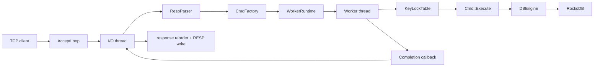

# MiniKV Architecture Audit

## Background And Scope

This document captures the current implementation state of `minikv/` in this
repository. It summarizes how the code is structured today, how requests flow
through the system, what storage model is in use, and which architectural risks
are already visible from the implementation.

The scope is limited to `minikv/` itself. It does not attempt to document the
whole RocksDB codebase.

`minikv/docs/` is the right place for this document instead of the `minikv/`
root. `minikv` is already a self-contained submodule, and a dedicated docs
directory leaves room for future protocol, storage, and evolution notes without
mixing them into code entrypoints.

Related documents:

- [README.md](./README.md)
- [getting-started.md](./getting-started.md)
- [build.md](./build.md)
- [layers/facade.md](./layers/facade.md)
- [layers/server.md](./layers/server.md)
- [layers/command.md](./layers/command.md)
- [layers/worker.md](./layers/worker.md)
- [layers/engine.md](./layers/engine.md)

If you have not read `minikv` before, start with
[getting-started.md](./getting-started.md) and come back here after you already
understand the request path and object graph.

## Module Layering

The current implementation is organized as a thin stack:

`main -> Server -> RESP parser / CmdFactory -> WorkerRuntime / KeyLockTable ->
Cmd -> DBEngine -> RocksDB`

The responsibilities are:

- `src/main.cc`: parses process flags, opens `MiniKV`, starts the TCP server.
- `include/minikv/minikv.h` and `src/minikv.cc`: public facade that owns the
  engine, shared key locks, and the compatibility async runtime.
- `src/server/`: TCP accept loop, per-I/O-thread connection management, RESP
  parsing, response encoding, worker runtime lifetime, and response reordering.
- `src/command/`: converts parsed command parts or compatibility
  `CommandRequest` values into registered `Cmd` objects and executes supported
  commands.
- `src/worker/`: runs bounded worker queues and keyed locking around command
  execution.
- `src/engine/`: RocksDB column-family management and hash-oriented data model.

Public behavior is intentionally narrow today:

- Supported commands: `PING`, `HSET`, `HGETALL`, `HDEL`
- Supported data type: hash only
- Supported deployment shape: single process, POSIX server path

## Request Lifecycle

The request path is split into network I/O and keyed execution:

1. `Server::AcceptLoop()` accepts client sockets and assigns them to an I/O
   thread in round-robin fashion.
2. Each I/O thread polls its own connections, reads bytes, appends into the
   per-connection read buffer, and uses `RespParser` to extract one or more RESP
   arrays.
3. Parsed parts are converted into a concrete `Cmd` by `CmdFactory`.
4. `Server` assigns a per-connection request sequence and submits the task into
   `WorkerRuntime`.
5. `WorkerRuntime` picks a worker queue with round-robin plus ring probing.
6. The worker thread acquires the striped key lock for `cmd->RouteKey()` and
   executes `Cmd::Execute()`, which calls `DBEngine`.
7. The completion callback pushes the `CommandResponse` back into the owning I/O
   thread's completed queue.
8. The I/O thread reorders completions by request sequence, encodes the
   response as RESP, and appends it to the connection's write buffer.
9. The I/O thread flushes buffered responses back to the client socket.

This split has one clear intent: keep socket progress on I/O threads while
serializing same-key execution on worker threads.

## Storage Model

`DBEngine` opens RocksDB with three column families:

- `default`: opened because RocksDB requires it, but it is not part of the
  current data model.
- `meta`: stores per-user-key metadata.
- `hash`: stores hash field/value pairs.

The data layout is driven by `KeyCodec`:

- Meta key: `m| + key_length + user_key`
- Hash data key prefix: `h| + key_length + user_key + version`
- Hash data key: `hash_prefix + field`

The metadata payload currently contains:

- `type`
- `encoding`
- `version`
- `size`
- `expire_at_ms`

Current behavior:

- `HSET` loads metadata, checks type, checks whether the field exists, updates
  `size`, and writes metadata plus field value in one `WriteBatch`.
- `HGETALL` loads metadata, derives the hash prefix, and scans the `hash`
  column family by prefix.
- `HDEL` loads metadata, probes requested fields one by one, deletes matching
  data keys, and updates or removes metadata in one `WriteBatch`.

This is a simple and workable model for a hash-only prototype. It also shows
that the implementation is already thinking in typed-keyspace terms rather than
as a flat string map.

## Concurrency Model

The concurrency design is based on keyed serialization:

- Connections are owned by I/O threads.
- Command execution is owned by worker threads.
- Requests are load-balanced across worker queues.
- Requests for the same key serialize on one striped mutex derived from
  `RouteKey()`.

Benefits of this model:

- Same-key updates avoid explicit coordination inside the engine.
- Network progress is decoupled from RocksDB calls.
- Different keys can execute in parallel across workers.
- Same-connection response order is preserved by the server reorder buffer.

Limits of this model:

- Correctness is still achieved above the storage layer, not by storage-level
  transaction boundaries.
- Stripe collisions can serialize unrelated keys.
- Cross-key request semantics are still not atomic.

## Architecture Audit

### P1: Correctness Relies On Routing Rather Than Strong Storage Boundaries

The implementation is safe for today's small command set mainly because all
same-key operations are serialized by the worker-layer key lock. The engine
itself does not expose richer transactional boundaries, multi-key atomicity, or
stronger invariants than what that runtime contract provides.

Impact:

- Extending command coverage becomes risky once commands span multiple keys,
  multiple objects, or read-modify-write flows that cannot be reduced to one
  routed key.
- Future correctness depends on preserving hidden assumptions in the dispatch
  layer.

Trigger:

- Adding more data types, rename-like operations, set algebra, transactions, or
  cross-key reads/writes.

Recommended follow-up:

- Make the execution consistency model explicit before adding broader command
  coverage. Either keep the system intentionally single-key scoped, or add a
  stronger storage/execution contract.

### P2: Backpressure Is Local To Worker Queues, Not Global To The Service

Backpressure is still applied as `max_pending_requests_per_worker`. Ring-probe
load balancing helps, but a saturated service can still fail one submission at a
time rather than making a global admission decision.

Impact:

- Tail latency and rejection behavior depend on key skew rather than whole-node
  load.
- Clients may see overload on hot keys even when the process still has spare
  capacity.

Trigger:

- Uneven key distribution or one extremely hot key.

Recommended follow-up:

- Add observability around per-worker queue depth and rejection counts, and
  decide whether the design should keep hot-key isolation or move toward a more
  global admission-control model.

### P2: Public API, Command Model, And RESP Model Are Tightly Coupled

`MiniKV` exposes both typed helper methods such as `HSet()` and generic command
execution via `Execute()` and `Submit()`. `CommandResponse` also mirrors RESP
concepts directly through `ResponseType`, integer/simple-string/array payloads,
and server-side encoding.

Impact:

- The library interface is not clearly separated from the wire protocol.
- Embedding `MiniKV` in a non-RESP environment would still pull in RESP-shaped
  abstractions.
- Expanding command coverage will grow protocol concepts inside the core API.

Trigger:

- Reusing `MiniKV` as an embedded library, or supporting additional frontends in
  the future.

Recommended follow-up:

- Separate storage/domain results from RESP transport formatting, even if the
  server continues to use a command-oriented internal path.

### P2: Metadata Schema Signals Future Features That Are Not Actually Implemented

The metadata contains `version` and `expire_at_ms`, but the current hash
implementation always uses version `1`, never bumps it, and never enforces TTL.
This means the metadata schema advertises lifecycle features that the execution
path does not honor.

Impact:

- Readers can infer capabilities that do not exist yet.
- Future maintainers may assume version-based invalidation or expiration is
  already wired through the engine when it is not.

Trigger:

- Any attempt to add expiration, lazy deletion, or logical version rollover on
  top of the current code.

Recommended follow-up:

- Either document these fields as reserved-for-future-use only, or complete the
  missing lifecycle semantics before relying on them in higher layers.

### P3: Server Extensibility And Operability Are Still Minimal

The server uses a hand-rolled `poll` loop plus wakeup pipes. That is acceptable
for a compact prototype, but the operational surface is thin:

- no built-in metrics or status endpoint
- no queue-depth, connection, or error instrumentation
- wakeup writes are ignored
- no structured shutdown/reporting path beyond thread termination

Impact:

- Capacity and failure analysis are hard once load or command coverage grows.
- Diagnosing stalls, overload, or response-ordering issues will be expensive.

Trigger:

- Running the service under sustained concurrency or trying to evolve it toward
  a more production-like profile.

Recommended follow-up:

- Add basic counters and structured logging first. Only then decide whether the
  I/O model itself needs to evolve.

## Current Architecture Summary

Today, `minikv` is best understood as a focused single-process hash service
built on top of RocksDB rather than as a general Redis-compatible engine.

Its strengths are:

- clear layering
- small command surface
- typed storage layout
- same-key serialization without invasive locking
- test coverage around basic hash semantics, network parsing, and some
  concurrency cases

Its current boundaries are:

- only hash data is implemented
- only a small RESP subset is accepted
- correctness assumptions are strongest for single-key operations
- the server path is POSIX-only
- observability and overload control are still lightweight

This makes the design suitable for experimentation and for validating the
storage model, but not yet a stable base for broad command expansion or stronger
protocol compatibility.

## Recommended Next Directions

The highest-value next steps are:

1. Fix same-connection cross-key response ordering.
2. Explicitly define the execution consistency model before adding more command
   types.
3. Separate core results from RESP-shaped response types to reduce API coupling.
4. Add first-class metrics for queue depth, rejections, inflight work, and
   connection lifecycle.
5. Decide whether `version` and `expire_at_ms` stay reserved fields or become
   implemented semantics.

## Validation Notes

This document was checked against the current code in:

- `minikv/src/server/`
- `minikv/src/command/`
- `minikv/src/worker/`
- `minikv/src/engine/`
- `minikv/include/minikv/`

Behavioral validation is expected to be performed from the standalone project
root in the Linux Docker workflow documented in [`build.md`](./build.md), using
`ctest --test-dir build --output-on-failure`.
